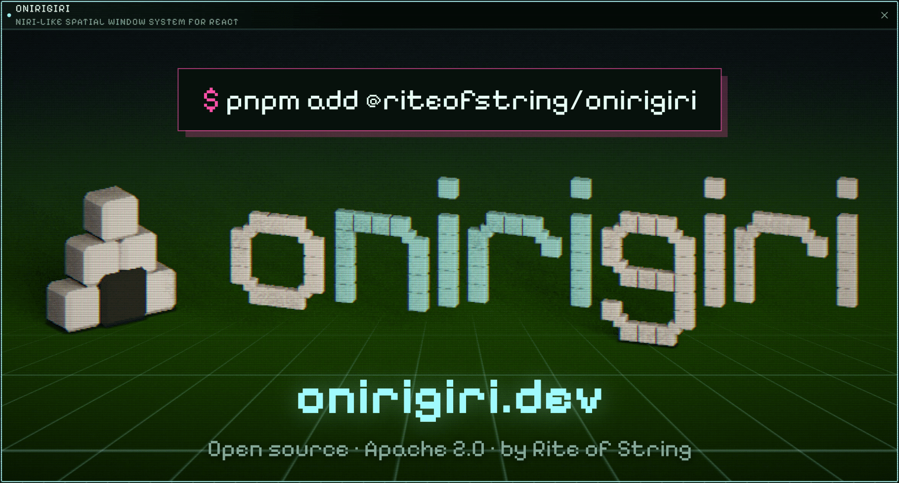

<p align="center">
  <a href="https://onirigiri.dev"></a>
</p>

Onirigiri is a React window system for spatially arranged panes. You supply pane
content; Onirigiri supplies tiled columns and rows, keyboard navigation and
rearrangement, a zoomable overview, resizing, maximization, a compact mobile
pager and serializable layouts.

Onirigiri is in **beta**. The API is settling; see [Known issues](#known-issues).

## Browser support

| Capability                                             | Requirement                                                                   |
| ------------------------------------------------------ | ----------------------------------------------------------------------------- |
| Workspace, navigation, overview, native content        | Current Chrome and Edge; Firefox and Safari pass smoke checks only            |
| Retained pane pictures and HTML-in-Canvas presentation | Chrome with WebGPU and HTML-in-Canvas (`chrome://flags/#canvas-draw-element`) |

Without WebGPU or HTML-in-Canvas nothing is blocked: panes present their native
content, requested canvas or texture presentation falls back to native, and panes
without a picture show a placeholder while moving or in overview.

## Install

```sh
pnpm add @riteofstring/onirigiri
```

React 18.2 or 19 is required as a peer dependency.

## Quick start

```tsx
import {
  OnirigiriWorkspace,
  type OnirigiriPaneDefinition,
} from "@riteofstring/onirigiri";
import "@riteofstring/onirigiri/styles.css";

const panes: OnirigiriPaneDefinition[] = [
  { paneId: "docs", surfaceKind: "document", title: "Documentation" },
  { paneId: "preview", surfaceKind: "preview", title: "Preview" },
];

export function App() {
  return (
    <div style={{ height: "100vh" }}>
      <OnirigiriWorkspace
        initialPanes={panes}
        renderPane={(pane) => <YourPane id={pane.paneId} />}
      />
    </div>
  );
}
```

The workspace fills its container, so give the container a height. Press
<kbd>Alt</kbd> + arrow keys (<kbd>Option</kbd> on macOS) to move between panes,
and <kbd>Alt</kbd> + <kbd>O</kbd> to toggle the overview.

## Core ideas

**Panes are data.** Each pane has a `paneId`, a `title` and a `surfaceKind`
(your own content type, such as `"editor"` or `"video"`). Put anything your
content needs in `data`. Layouts are plain JSON, so they can be saved, restored
and synchronized.

**You render the content.** `renderPane(pane, state)` returns ordinary React.
Onirigiri keeps that subtree mounted and moves it; it never clones or serializes
it. `state` tells content how it is being shown:

| Field              | Meaning                                                                   |
| ------------------ | ------------------------------------------------------------------------- |
| `runtimeState`     | `"live"`, `"frozen"` (moving or overview) or `"hidden"` (offscreen)       |
| `visible`          | The pane intersects the viewport                                          |
| `focused`          | The pane has workspace focus                                              |
| `maximized`        | The pane fills the workspace                                              |
| `presentationMode` | `"normal"` or `"overview"`                                                |
| `content`          | Content-fit preferences from [pane defaults](docs/guide/pane-defaults.md) |

Pause expensive work when a pane is not live:

```tsx
renderPane={(pane, state) => (
  <Chart series={pane.data as Series} paused={state.runtimeState !== "live"} />
)}
```

**Everything is configured with props.** Every option is a plain value or
callback on `<OnirigiriWorkspace>`; there are no providers or global setup.

## Recipes

### Save and restore the layout

```tsx
import {
  assertOnirigiriLayout,
  type OnirigiriLayout,
} from "@riteofstring/onirigiri";

function savedLayout(): OnirigiriLayout | null {
  try {
    const layout = JSON.parse(localStorage.getItem("workspace") ?? "null");
    if (layout) assertOnirigiriLayout(layout);
    return layout;
  } catch {
    return null;
  }
}

<OnirigiriWorkspace
  initialLayout={savedLayout()}
  initialPanes={panes}
  onLayoutChange={(layout) =>
    localStorage.setItem("workspace", JSON.stringify(layout))
  }
  renderPane={renderPane}
/>;
```

`onLayoutChange` reports `initial`, `user` and `restore` changes with a mutation
ID so one resize gesture can become one undo entry. Camera movement and
presentation changes do not emit layout changes. `initialLayout` and
`restoreLayout` throw on an invalid document, so validate stored layouts with
`assertOnirigiriLayout` first, as above.

### Control the workspace from code

```tsx
const workspace = useRef<OnirigiriWorkspaceHandle>(null);

<OnirigiriWorkspace
  ref={workspace}
  initialPanes={panes}
  renderPane={renderPane}
/>;

workspace.current?.openPane({
  title: "Report",
  surfaceKind: "document",
  data: report,
});
workspace.current?.focusPane("docs");
workspace.current?.toggleOverview();
```

See [Imperative handle](#imperative-handle) for every method.

### Size panes by content type

```tsx
<OnirigiriWorkspace
  paneDefaults={{ width: 480, height: "viewport" }}
  paneTypeDefaults={{
    video: { width: "auto", aspectRatio: 16 / 9, content: { fit: "contain" } },
    editor: { width: 900, minWidth: 360 },
  }}
  {...props}
/>
```

Workspace defaults are overridden by type defaults, then by a pane's own
`defaults`. Details: [Pane defaults](docs/guide/pane-defaults.md).

### Choose resize handles

Panes get right and bottom resize handles by default. `resizeEdges` picks any
combination of `"left"`, `"right"`, `"top"` and `"bottom"` for the workspace, a
content type or a single pane:

```tsx
import { defaultPaneResizeEdges } from "@riteofstring/onirigiri";

<OnirigiriWorkspace
  paneDefaults={{ resizeEdges: [...defaultPaneResizeEdges, "left", "top"] }}
  initialPanes={[
    { paneId: "home", surfaceKind: "page", title: "Home" },
    {
      paneId: "hover",
      surfaceKind: "game",
      title: "Hover!",
      defaults: { resizeEdges: ["right"] },
    },
  ]}
  {...props}
/>;
```

Dragging a left or top edge keeps the opposite edge still. Details:
[Pane defaults](docs/guide/pane-defaults.md#resize-handles).

### Link to a pane

`paneLink` keeps the focused pane in the URL, so `https://example.com/?pane=hover`
opens the workspace on the pane whose `paneId` is `hover`, wherever it sits:

```tsx
import { onirigiriPaneHref } from "@riteofstring/onirigiri";

<OnirigiriWorkspace paneLink initialPanes={panes} renderPane={renderPane} />;

const href = onirigiriPaneHref("hover"); // current URL with ?pane=hover
```

Pass `{ param: "window", history: "push" }` to rename the parameter or record
each focus change as a history entry. Details:
[Navigation and layout](docs/guide/navigation-and-layout.md#pane-links).

### Theme it

```tsx
import { defineOnirigiriTheme } from "@riteofstring/onirigiri";

const theme = defineOnirigiriTheme({
  "--onirigiri-pane-radius": "16px",
  "--onirigiri-focus": "oklch(0.72 0.17 250)",
});

<OnirigiriWorkspace tokens={theme} {...props} />;
```

`classNames` and `styles` target individual slots, and `chromeComponents` swaps
in your design system's buttons. Details: [Styling](docs/guide/styling.md).

### Use your own components (for example shadcn/ui)

Onirigiri renders plain accessible buttons and no tooltips. Overrides receive
the button props to forward plus a typed descriptor with the label,
availability and platform-formatted shortcuts (primary binding first). A pane
action override may return `null` to omit that action.

```tsx
const chromeComponents = defineOnirigiriChromeComponents({
  WorkspaceControlButton: ({ control, ...props }) => (
    <Tooltip>
      <TooltipTrigger asChild>
        <Button variant="ghost" size="icon" {...props} />
      </TooltipTrigger>
      <TooltipContent>
        {control.label}
        {control.shortcuts[0]?.keys.map((key) => (
          <kbd key={key}>{key}</kbd>
        ))}
      </TooltipContent>
    </Tooltip>
  ),
  PaneActionButton: ({ action, ...props }) =>
    action.id === "maximize" ? null : <Button size="icon-sm" {...props} />,
});

<OnirigiriWorkspace chromeComponents={chromeComponents} {...props} />;
```

With `showControls={false}`, `getOnirigiriShortcutBindings` and
`formatOnirigiriShortcut` give your own control bar the same shortcut data.
Details: [Styling](docs/guide/styling.md#design-system-components).

### Keep content animating while navigating

```tsx
<OnirigiriWorkspace liveContent {...props} />
```

`liveContent` keeps every pane mounted and live through navigation and overview.
It costs memory and CPU proportional to the number of panes, so prefer it for
small to medium workspaces. Without it, only nearby panes stay mounted and
applications receive `runtimeState: "frozen"` while the camera moves.

### Choose how panes are presented

```tsx
<OnirigiriWorkspace
  panePresentation="auto"
  getPanePresentation={(pane, context) =>
    pane.surfaceKind === "map" && context.phase === "overview"
      ? { kind: "texture", detail: "preview" }
      : undefined
  }
  {...props}
/>
```

`"auto"` (the default) keeps content native, which is the fastest option on every
machine we measured. Per pane and phase you can request `"dom"`, `"canvas"`
(HTML-in-Canvas), `{ kind: "texture" }` (a frozen picture) or
`{ kind: "placeholder" }`. Details: [Presentation](docs/guide/presentation.md).

### Customize shortcuts

```tsx
import { defaultOnirigiriShortcuts } from "@riteofstring/onirigiri";

<OnirigiriWorkspace
  shortcuts={{
    toggleOverview: [
      ...defaultOnirigiriShortcuts.toggleOverview,
      {
        key: "F3",
        altKey: false,
        ctrlKey: false,
        metaKey: false,
        shiftKey: false,
      },
    ],
    splitDown: [],
  }}
  shortcutScope="application"
  {...props}
/>;
```

Actions you omit keep their defaults, and an empty array disables an action.

`shortcutScope="workspace"` (the default) handles keys only while focus is inside
the workspace; `"application"` handles them page-wide. Pass `shortcuts={false}`
to disable all of them. Details: [Navigation and keyboard](docs/guide/navigation-and-layout.md).

## Props

Only `renderPane` is required.

### Content and layout

| Prop                                  | Default                 | Purpose                                                 |
| ------------------------------------- | ----------------------- | ------------------------------------------------------- |
| `renderPane`                          | —                       | `(pane, state) => ReactNode` for each pane's content    |
| `initialPanes`                        | `[]`                    | Panes for a new workspace                               |
| `initialLayout`                       | `null`                  | A saved layout; takes precedence over `initialPanes`    |
| `onLayoutChange`                      | —                       | Receives every committed layout with change metadata    |
| `onPaneClose`                         | —                       | Return `false` (or a promise of it) to keep a pane open |
| `paneDefaults`                        | —                       | Size, content fit and resize edges for every pane       |
| `paneTypeDefaults`                    | —                       | Defaults keyed by `surfaceKind`                         |
| `paneLimits`                          | —                       | Maximum number of panes per `surfaceKind`               |
| `allowResizedPanesToOverflowViewport` | `false`                 | Let resized panes grow wider than the viewport          |
| `keepHeightWhenSplitting`             | `false`                 | Split a pane up or down within its current height       |
| `workspaceId`                         | `"onirigiri-workspace"` | Identity stored in layouts                              |

### Navigation and camera

| Prop                                               | Default      | Purpose                                                          |
| -------------------------------------------------- | ------------ | ---------------------------------------------------------------- |
| `focusAnchor`                                      | `"center"`   | Center the focused pane, or keep it at the `"start"` edge        |
| `gridAxes`                                         | `"spatial"`  | `"horizontal"` restricts navigation to one row of columns        |
| `cameraModes`                                      | follow both  | `"fixed"` or `"follow"` camera per presentation mode             |
| `cameraMotion`                                     | follow       | Curves for navigation, overview moves and the overview zoom      |
| `focusHighlight`                                   | `true`       | `false` hides the highlight; `{ motion }` sets how it moves      |
| `showMinimap`                                      | `false`      | Show a minimap of pane boxes that focuses the pane you click     |
| `minimapPlacement`, `onMinimapPlacementChange`     | bottom-right | Minimap corner and size, and a callback to persist changes       |
| `minimapAdjustable`                                | `true`       | Let people move the minimap between corners and resize it        |
| `cursorRunway`                                     | —            | Limit empty-cell navigation to N cells around the panes          |
| `paneLink`                                         | —            | Keep the focused pane in the URL query; `true` or options        |
| `directionControlMode`                             | `"focus"`    | What the on-screen arrows do: focus, move a pane or move a group |
| `onPresentationModeChange`                         | —            | Called when entering or leaving overview                         |
| `onPaneRearrangementSelectionChange`               | —            | Called when pane or group rearrangement selection changes        |
| `overviewCardMinWidthPx`, `overviewCardMaxWidthPx` | —            | Bounds for pane size in overview                                 |

### Controls, keyboard and compact layout

| Prop                       | Default                 | Purpose                                                   |
| -------------------------- | ----------------------- | --------------------------------------------------------- |
| `showControls`             | `true`                  | Show the on-screen navigation controls                    |
| `showOverviewControl`      | `true`                  | Show the overview button                                  |
| `desktopControlsContainer` | —                       | Render the desktop controls into your own element         |
| `shortcuts`                | defaults                | Key bindings, or `false` to disable                       |
| `shortcutScope`            | `"workspace"`           | `"workspace"` or page-wide `"application"`                |
| `compactBreakpoint`        | `640`                   | Width in pixels below which the workspace becomes a pager |
| `compactPanePeek`          | `0`                     | Pixels of neighboring panes visible in the compact pager  |
| `ariaLabel`                | `"Onirigiri workspace"` | Accessible name of the workspace region                   |

### Styling

| Prop                   | Purpose                                                           |
| ---------------------- | ----------------------------------------------------------------- |
| `tokens`               | Theme tokens (`defineOnirigiriTheme`)                             |
| `className`, `style`   | Class and style for the workspace root                            |
| `classNames`, `styles` | Per-slot classes and styles                                       |
| `chromeComponents`     | Replace buttons and controls with your design system's components |

### Presentation and pictures

| Prop                       | Default  | Purpose                                                           |
| -------------------------- | -------- | ----------------------------------------------------------------- |
| `liveContent`              | `false`  | Keep every pane mounted and live through motion and overview      |
| `panePresentation`         | `"auto"` | Workspace-wide presentation choice                                |
| `getPanePresentation`      | —        | Per-pane, per-phase presentation choice                           |
| `renderPanePlaceholder`    | icon     | Custom placeholder content                                        |
| `getPanePicture`           | —        | Supply your own pictures for panes that are not mounted           |
| `onPanePresentationChange` | —        | Observe each pane's effective presentation                        |
| `onCaptureStatusChange`    | —        | Observe picture capture, including `"unavailable"` and its reason |

Advanced tuning, rarely needed: `retainedAreaBudgetViewports` (8),
`preloadMarginPanes` (1), `preloadAllPanePictures` (false),
`captureMissingOverviewPictures` (false), `pictureBudgetBytes` (256 MiB),
`pictureRasterBudgetBytes` (256 MiB), `pictureMinLongEdgePx` (128). See
[Presentation](docs/guide/presentation.md).

## Imperative handle

Attach a ref to `<OnirigiriWorkspace>` to receive an `OnirigiriWorkspaceHandle`.

| Area          | Methods                                                                                                      |
| ------------- | ------------------------------------------------------------------------------------------------------------ |
| Panes         | `openPane`, `openPaneNear`, `configurePane`, `renamePane`, `closePane`                                       |
| Splits        | `splitPane`, `splitPaneToPlane`, `insertPaneAsSplit`, `createReservedBlankSplit`, `removeReservedBlankSplit` |
| Focus         | `focus`, `focusPane`, `focusColumn`, `returnHome`, `setFocusAnchor`                                          |
| Rearrangement | `movePane`, `movePaneGroup`, `selectPaneGroup`, `clearPaneRearrangementGroup`                                |
| View          | `toggleOverview`, `resizePanes("default" \| "fit-content" \| "minimum" \| "full")`                           |
| Layout        | `getLayout`, `restoreLayout`, `getScene`, `getSnapshot`                                                      |
| Pictures      | `getCaptureStatus`, `getPanePresentationState`, `refreshPanePictures`                                        |

`restoreLayout` validates the whole document first and throws without changing
the workspace if it is invalid.

## Guides

- [Pane defaults](docs/guide/pane-defaults.md): sizes, limits, content fit and resize handles.
- [Styling](docs/guide/styling.md): tokens, slots, design-system components and accessibility.
- [Navigation, layout and keyboard](docs/guide/navigation-and-layout.md).
- [Presentation](docs/guide/presentation.md): runtime states, live content, presentation policies and retained pictures.
- [Development](docs/guide/development.md): repository commands and test setup.

## Development

The interactive 1D and 2D demo playground lives in [`playground/`](playground),
and its lab panes come from
[browser-surface-lab](https://github.com/riteofstring/browser-surface-lab).
Run `pnpm dev:1d` or `pnpm dev:2d`; see [Development](docs/guide/development.md).

## Known issues

- Retained pictures and HTML-in-Canvas presentation require Chrome with WebGPU
  and the HTML-in-Canvas flag. Elsewhere, panes that are not mounted show
  placeholders during motion and overview.
- Chrome copies element images with a synchronous GPU readback. Explicit
  `"canvas"` presentation of content that changes every frame therefore cannot
  hold high refresh rates on discrete GPUs; the default `"auto"` presentation
  avoids it.
- Occasional single dropped frames remain when navigation starts while
  applications initialize or pictures are captured. In branded Chrome, moving
  pane content that contains form controls schedules a password-manager scan
  about 100 ms later, which can drop a frame if motion has started.
- Captured text can differ from native text at glyph edges on Linux.

## License

Licensed under the [Apache License 2.0](LICENSE).
